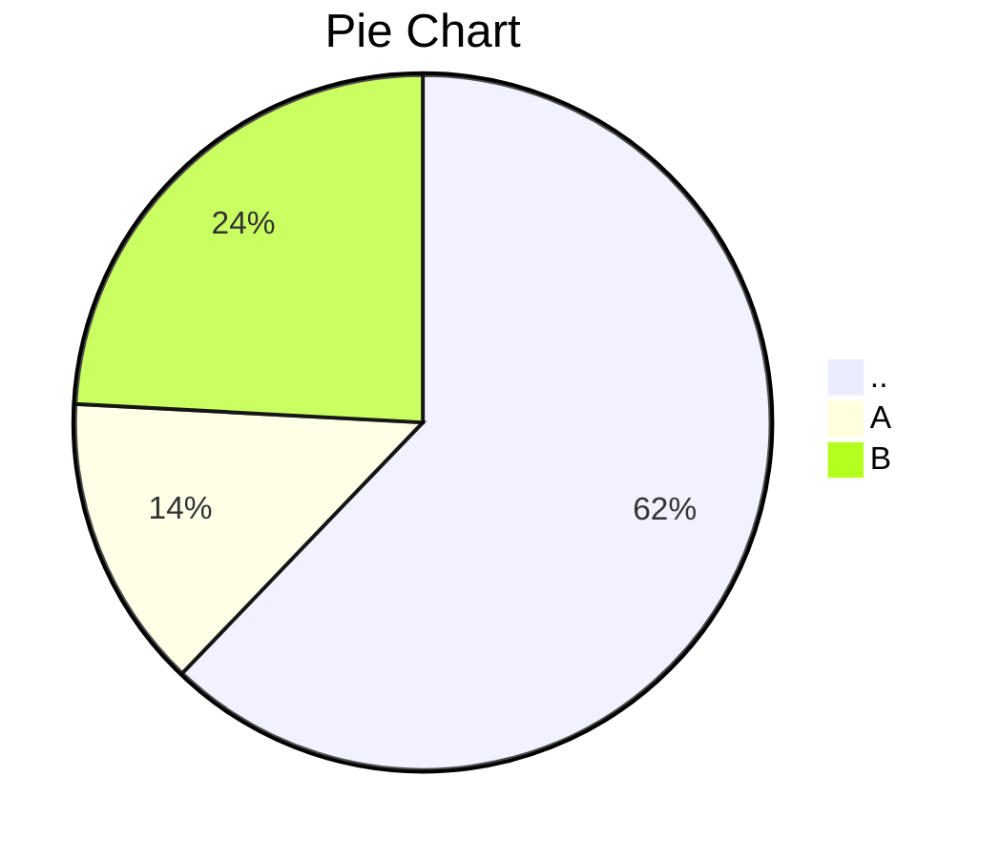

### I18N-FOR-BEGINNERS : 'main' branch : '종강하고싶다' commit [with message "ㄹㅇ루다가"]
### Compare on 
### I18N-FOR-BEGINNERS_ko : 'main' branch : "나도" commit [with message "ㅜㅜ"]
---

 root 디렉토리에 A 폴더와 m4, m5.md 가 있다고 가정.  
 A 폴더 내에 B폴더와 m1.md가 있다고 가정.  
 B 폴더 내에 C폴더와 m2.md가 있다고 가정.  
 C 폴더 내에 m3.md 가 있다고 가정합니다.  

* ### change on dir '/root'

  - m4.md ( MODIFIED )
> 
 
 > Details  
 
 ### Committed change with file '/root/m4.md'  
>  
>line 12 : -  
>line 12 : This sentence added  
>  
>line 15 : Thie sentence will be modified  
>line 15 : Hello world!  
>  
>---
> as total, 30 words added. 12 words deleted.  
> m3.md in 'I18N-FOR-BEGINNERS' repo ( updated ) has 300 word.  
> m3.md in 'I18N-FOR-BEGINNERS_ko' repo ( had been updated on 2022-05-20 ) has 290 word.  
> Approximately 10 words need to be translated added.  
>
> ### Added words( need te be translated ) rate 96.5% ( 290 / 300 words )  
>
>

>

### directory '/root' change statistics
> 
 
 > Details  
 
 ### Committed change with directory '/root'
>  
> /m4.md : 30 words added. 30 words deleted.  
> /m5.md : 30 words added. 30 words deleted.  
 > /m55.md : 30 words added. 30 words deleted.  
> ( 대충 리스트 업 )  
> /m444.md : 30 words added. 29 words deleted.  
>  
> ---
> as total, 150 words added. 100 words deleted.  
> /root in 'I18N-FOR-BEGINNERS' reop ( updated ) has 6000 word.  
> /root in 'I18N-FOR-BEGINNERS_ko' repo ( had been updated on 2022-05-20 ) has 5900 word.  
> Approximately 100 words need to be translated added.  
> ### Added words(need te be translated) rate 98.5% ( 5900 / 6000 words )
>

>

* ### change on dir 'A'

  - m4.md ( MODIFIED )
>
 
 > Details  
 

> ### Committed change with file '/root/sampel/docs/A/m3.md'
>  
> line 12 : -  
> line 12 : This sentence2 added  
>  
> line 15 : Thie sentence2 will be modified  
> line 15 : Hello world!  
>  
>---
> as total, 30 words added. 12 words deleted.  
> m3.md in 'I18N-FOR-BEGINNERS' repo ( updated ) has 3000 word.  
> m3.md in 'I18N-FOR-BEGINNERS_ko' repo ( had been updated on 2022-05-20 ) has 2900 word.  
> Approximately 100 words need to be translated added.  
> ### Added words(need te be translated) rate 96.5% ( 2900 / 3000 words )  
>

>

### directory 'A' change statistics
>
 
 > Details  
 
### Committed change with directory '/root/A'
>  
>/A/m1.md : 30 words added. 30 words deleted.  
>/A/B/m2.md : 30 words added. 29 words deleted.  
>/A/B/C/m3.md : 30 words added. 28 words deleted.  
>  
>---
>as total, 150 words added. 100 words deleted.  
>/A in 'I18N-FOR-BEGINNERS' repo (updated ) has 6000 word.  
>/A in 'I18N-FOR-BEGINNERS_ko' repo ( had been updated on 2022-05-20 ) has 5900 word.  
>Approximately 100 words need to be translated added.  
> ### Added words(need te be translated) rate 98.5% ( 5900 / 6000 words )  
>

>

---
## repository change statistics
>
 
 > Details  
 
### Comitted change with repo 'I18N-FOR-BEGINNERS'
>  
>'..' dir : 30 words added. 30 words deleted.  
>'A' dir : 30 words added. 29 words deleted.  
>'B' dir : 30 words added. 28 words deleted.  
>'C' dir : 40 words added. 20 words deleted.  
>  
>---
>as total, 3000 words added. 1200 words deleted.  
>'main' branch on 'I18N' repo ( updated ) has 90000 words.  
>'main' branch on 'I18N-FOR-BEGINNERS' repo ( had been updated on 2022-05-20 ) has 89000 words.  
>Approximately 9000 words need to be translated added.  
> ### Added words(need te be translated) rate 98.5% ( 89000 / 90000 words )
>

>

